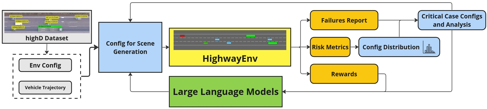

# Enhancing Autonomous Vehicle Training with Language Integration and Critical Scenario Generation

We introduce CRITICAL, a novel closed-loop framework for autonomous vehicle (AV) training and testing. CRITICAL stands out for its ability to generate
diverse scenarios, focusing on critical driving situations that
target specific learning and performance gaps identified in the
Reinforcement Learning (RL) agent. The framework achieves
this by integrating real-world traffic dynamics, driving behavior
analysis, surrogate safety measures, and an optional Large
Language Model (LLM) component. It is proven that the establishment of a closed feedback loop between the data generation
pipeline and the training process can enhance the learning
rate during training, elevate overall system performance, and
augment safety resilience. 

We experimentally evaluated this framework on Proximal Policy Optimization (PPO) agents within the HighwayEnv
simulation environment. Noticeable performance
improvements were observed with the integration of critical case generation and LLM analysis, indicating CRITICAL’s potential to improve
the robustness of AV systems and streamline the generation
of critical scenarios. This ultimately serves to hasten the
development of AV agents, expand the general scope of RL
training, and ameliorate validation efforts for AV safety.

<p align="center">

</p>

## Initial Set-up and Getting Started
Ensure you have Conda installed on your system to create a Python environment with the necessary dependencies.

```python
conda create -n llmav python=3.10.14
conda activate llmav

pip install -r requirements.txt
pip install -e .
```

You can now run the default execution flow of CRITICAL.

```python
python main.py
```

The execution flow of CRITICAL using the default parameters progresses as follows:
1) The framework first sets up an environment configuration based on typical real-world traffic from the highD dataset. 
2) These configurations are then leveraged to generate HighwayEnv scenarios. 
3) At the end of each episode, CRITICAL collects episodic data such as failure reports, risk metrics, and rewards. This process is repeated multiple times to gather a collection of configuration files with associated scenario risk assessments. 
4) To enhance RL training, we analyze a distribution of configurations based on risk metrics, identifying those conducive to critical scenarios. 
5) We then directly use these configurations to expose the RL agent to new, challenging scenarios tailored to the performance of the RL agent.  

## Large Language Model Integration

This section integrates a Large Language Model (LLM) provided by Ollama to enhance the realism and effectiveness of our scenario generation. The LLM utilizes driving data to generate scenario suggestions that are vital for creating adaptive and robust training environments. CRITICAL's execution flow with LLM integration deviates from the default execution flow (outlined above) in step 5, as follows: 

5) We do not directly use CRITICAL's data-driven risk analysis to expose new scenarios to the RL agent. Instead, we first push this data-driven analysis to an LLM via LangChain, a tool designed for leveraging language models to enhance scenario analysis and generation in AV simulations. We then use the generated response **in conjunction** with our quantitative episodic analysis to enhance critical case generation.

This setup allows CRITICAL to use its embedded language models effectively for analyzing our data and configuration, thereby generating relevant and practical changes to our simulation scenarios. The enhancemment to critical case generation greatly improves RL-agent training; demonstrated by an increase in average episodic reward, increase in average epidosic length, and reduced number of crashes overall.    

### Installing Ollama

To install Ollama, follow the detailed installation instructions on [Ollama](https://github.com/ollama/ollama).

After installing Ollama, fetch the required LLM model with the following command:

```bash
ollama pull mistral:7b-instruct-q5_K_M
```

### Execute CRITICAL with LLM Integration

To run CRITICAL's data-driven risk analysis _augmented_ with LLM prompts to further improve RL-agent training, edit main.py/run the following command.

```python

```

## Repository Structure
To-be completed. 

## Schematic of CRITICAL's Architecture

An architecture diagram mapping out the various components of CRITICAL. 