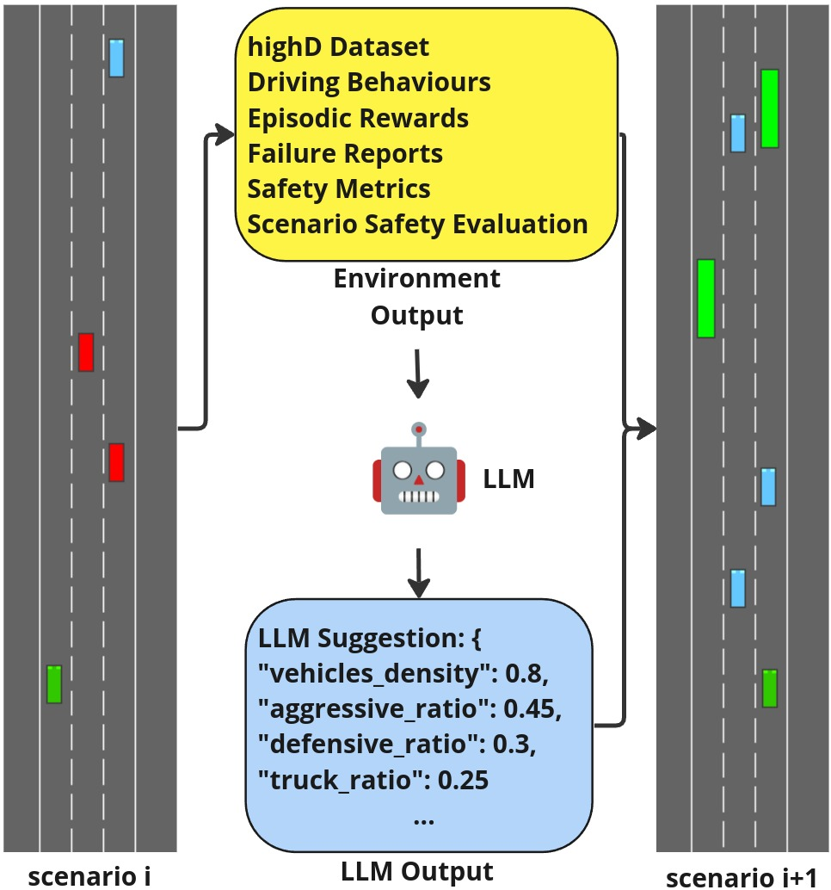

# Enhancing Autonomous Vehicle Training with Language Integration and Critical Scenario Generation

We introduce CRITICAL, a novel closed-loop framework for autonomous vehicle (AV) training and testing. CRITICAL stands out for its ability to generate
diverse scenarios, focusing on critical driving situations that
target specific learning and performance gaps identified in the
Reinforcement Learning (RL) agent. The framework achieves
this by integrating real-world traffic dynamics, driving behavior
analysis, surrogate safety measures, and an optional Large
Language Model (LLM) component. It is proven that the establishment of a closed feedback loop between the data generation
pipeline and the training process can enhance the learning
rate during training, elevate overall system performance, and
augment safety resilience. 

We experimentally evaluated this framework on Proximal Policy Optimization (PPO) agents within the HighwayEnv
simulation environment. Noticeable performance
improvements were observed with the integration of critical case generation and LLM analysis, indicating CRITICAL’s potential to improve
the robustness of AV systems and streamline the generation
of critical scenarios. This ultimately serves to hasten the
development of AV agents, expand the general scope of RL
training, and ameliorate validation efforts for AV safety.



## Initial Set-up and Getting Started
Ensure you have Conda installed on your system to create a Python environment with the necessary dependencies.

```python
conda create -n llmav python=3.10.14
conda activate llmav

pip install -r requirements.txt
pip install -e .
```


## Critical Scenario Generation


## Large Language Model Integration


